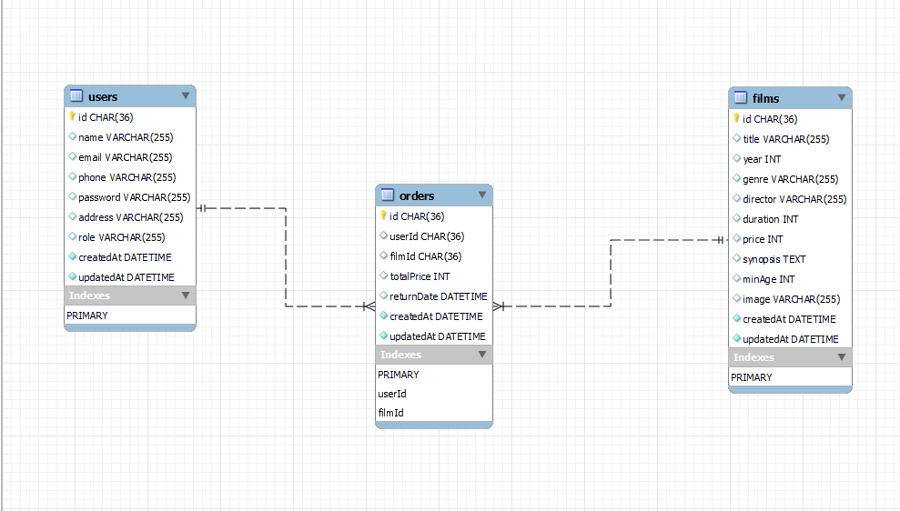
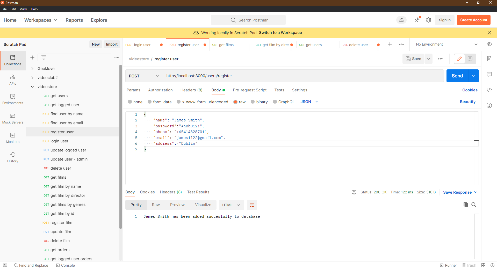
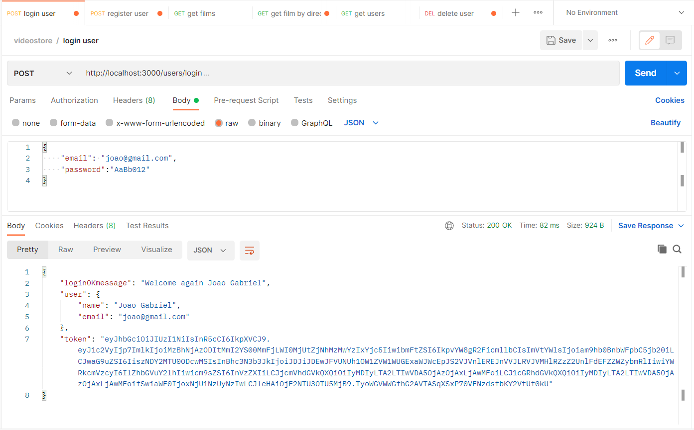
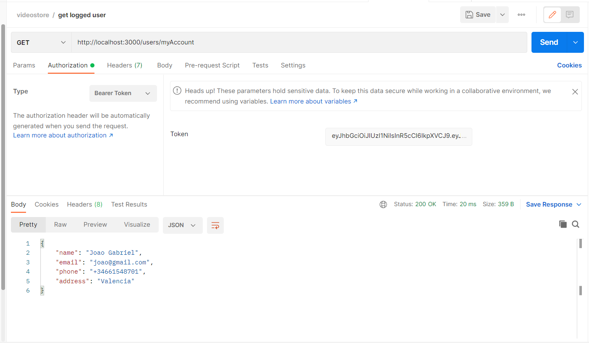
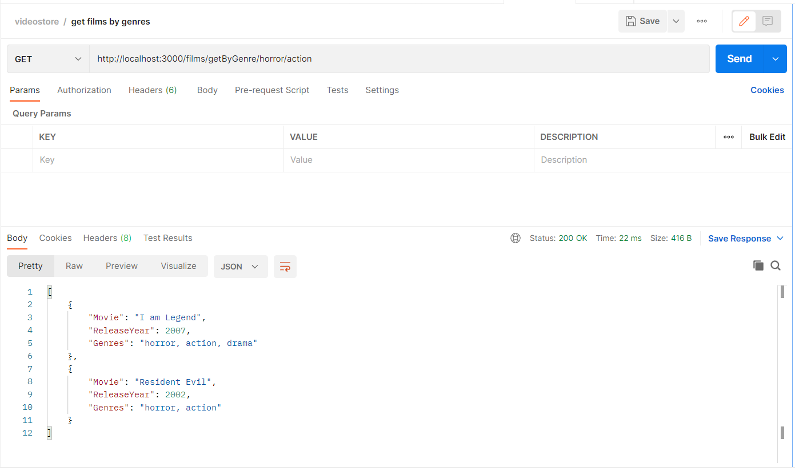
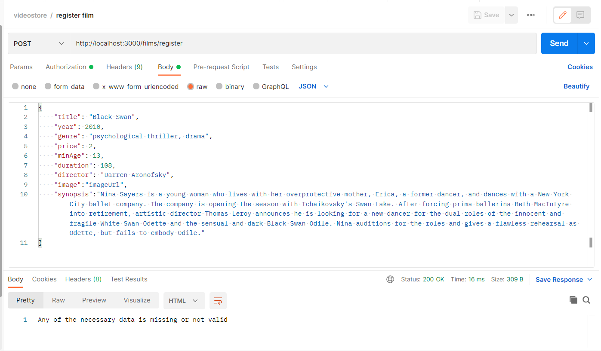

#### PROYECTO GEEKSHUBS 4: BACKEND DE UN VIDEOCLUB

#### Definición y alcance:

El objeto de este proyecto con fines de formación, el cuarto de los que desarrollamos durante el bootcamp "Full Stack Developer" en GeeksHubs, es la realización de un backend básico en modelo vista-controlador de un videoclub:  
 
- La base de datos será relacional de tipo SQL y contará con 3 tablas / modelos, a saber:  
    - User, con los datos personales de los clientes.  
    - Films, con datos relevantes de las películas que se ofrecen.  
    - Orders, con datos necesarios sobre cada alquiler.  
- Entre las mínimas operaciones disponibles no deben faltar distintos endpoints para consultar las tablas, registro y autentificación de usuarios, login, administrador y registro de alquiler de películas.  
- CRUD de usuario y administrador con las operaciones básicas.  

#### Tecnologías aplicadas:

Necesario: Javascript, Node.js, Express, SQL, MySQL, Sequelize, Sequelize-cli, jsonwebtoken, bcript, dotenv, UUID.
Muy recomendado: MySQL Workbench, Postman, Nodemon.

#### Objetivos:

1- Familiarizarse con la estructura de backend vista-controlador.  
2- Uso correcto de promesas y async / await.  
3- Crud de usuario variado, incluyendo funciones controladoras que usen queries tanto en SQL como las propias de Sequelize.  

Adicionalmente y a modo de entrenamiento, se ha dispuesto de herramientas de validación de entradas de datos basadas en Regex. También se ha modificado el tipo de datos por defecto de sequelize para las id, de INTEGER a UUID (ver dependencias) 

#### Instrucciones de uso:

1- Clonar este proyecto en nuestro repositorio local. Desde consola:  
    git clone https://github.com/AntonioML-sc/GameForGeeksHubs.git  

2- Instalar las dependencias necesarias incluidas en package.json:  
    npm i  

4- Crear una base de datos llamada 'videostore' usando MySQL Workbench (recomendado)  

5- Migrar los modelos a la base de datos local:  
    sequelize db:migrate  

En este punto ya tendremos una base de datos como la mostrada: 

Ahora ya podemos realizar peticiones a través de los endpoints (recomendado Postman). Se ha asignado el puerto 5000 por defecto, de manera que la raíz de las peticiones será:  
    http://localhost:5000  

#### Listado de endpoints:

1- Users:  

- GET http://localhost:5000/users/ => (solo admin) Muestra la información de todos los usuarios registrados.  

- POST http://localhost:5000/users/register => Registro de usuario nuevo. Se procede a la validación de los datos. La contraseña debe tener un mínimo de 8 caracteres, una letra mayúscula, una minúscula, un número y un caracter especial. El resto de campos deben tener un formato válido. El email no puede estar ya registrado.  

- POST http://localhost:5000/users/login => Login de usuario, pasando por body email y password. Si las credenciales son válidas, se proveerá del token necesario para acceder al resto de funciones que exijan autentificación. Para acceder a las funciones que exijan ser administrador, es necesario que el registro de ese usuario tenga el campo 'role':'admin'. Por motivos obvios no es posible crear un usuario con credenciales de administrador a través de peticiones, de modo que para disponer de un administrador es preciso editar este campo directamente en el registro de User en la base de datos.  

- POST http://localhost:5000/users/getByName => (solo admin) Muestra la información de todos los usuarios registrados con una coincidencia parcial con el nombre introducido.  
- POST http://localhost:5000/users/getByEmail => (solo admin) Muestra la información del usuario con el email indicado.  
- GET http://localhost:5000/users/myAccount => (con autentificación) Muestra la información del usuario que haya hecho login. Sus credenciales se obtienen del token, que es necesario.  

- DELETE http://localhost:5000/users/delete => (solo admin) Permite borrar un usuario de la base de datos. Su id se pasa por body. 
- PUT http://localhost:5000/users/update/:id => (solo admin) Permite modificar parte de los datos de un usuario, facilitados por body, cuya id se indica también por body. 
- PUT http://localhost:5000/users/editMyAccount => (con autentificación) Permite modificar parte de los datos del usuario que haya hecho login. Sus credenciales se obtienen del token, que es necesario.  

2- Films:  

- GET http://localhost:5000/films/ => Muestra la información de todas las películas registradas.  
- GET http://localhost:5000/films/getByGenre/:genre1/:genre2/:genre3 => Muestra la información de todas las películas filtradas por coincidencias con uno, dos o tres géneros, provistos por url, ordenadas por año de lanzamiento (primero las más recientes).  

- GET http://localhost:5000/films/getById' => (solo admin) Muestra la información del film con el id indicado por body.  
- GET http://localhost:5000/films/getByTitle/:title => Muestra la información de todas las películas filtradas por coincidencias con el título indicado por url.  
- GET http://localhost:5000/films/getByDirector/:director => Muestra la información de todas las películas filtradas por coincidencias con el nombre del director, indicado por url.  
- POST http://localhost:5000/films/register => (solo admin) Permite introducir una nueva película en la base de datos. El título no puede estar ya registrado.  

- DELETE http://localhost:5000/films/delete' => (solo admin) Permite borrar un film de la base de datos. Su id se pasa por body. 
- PUT http://localhost:5000/films/update => (solo admin) Permite modificar los datos de un film, facilitados por body, cuya id se indica también por body. 

3- Orders:  

- GET http://localhost:5000/orders/ => (solo admin) Muestra la información de todos los alquileres registrados, en orden cronológico descendente.  
- GET http://localhost:5000/orders/userOrders => (con autentificación) Muestra la información de todos los alquileres registrados a nombre del usuario que haya hecho login. Las credenciales del usuario se obtienen de su token.  
- POST http://localhost:5000/orders/getByEmail => (solo admin) Muestra la información de todos los alquileres registrados a nombre del usuario cuyo email se indica por body 
- POST http://localhost:5000/orders/register => (con autentificación) Permite al usuario que haya hecho login registrar el alquiler de una película a su nombre.  
- DELETE http://localhost:5000/orders/delete => (solo admin) Permite borrar un registro de alquiler de la base de datos. Su id se pasa por body. 
- PUT http://localhost:5000/orders/update/:id => (solo admin) Permite modificar los datos de un registro de alquiler, facilitados por body, cuya id se indica por url. 

#### Bugs conocidos y posibles nuevos trabajos:

- Limpieza y optimización del código. Siempre hay algo que mejorar.  
- Otras peticiones que puedan ser convenientes, así como mejorar la información facilitada en algunas de las existentes.  
- Ampliar y mejorar la validación de datos.  
- Cualquier sugerencia será bien recibida.

#### Créditos y agradecimientos:

- A los docentes y compañeros de GeeksHubs por la formación y el ánimo para seguir mejorando.